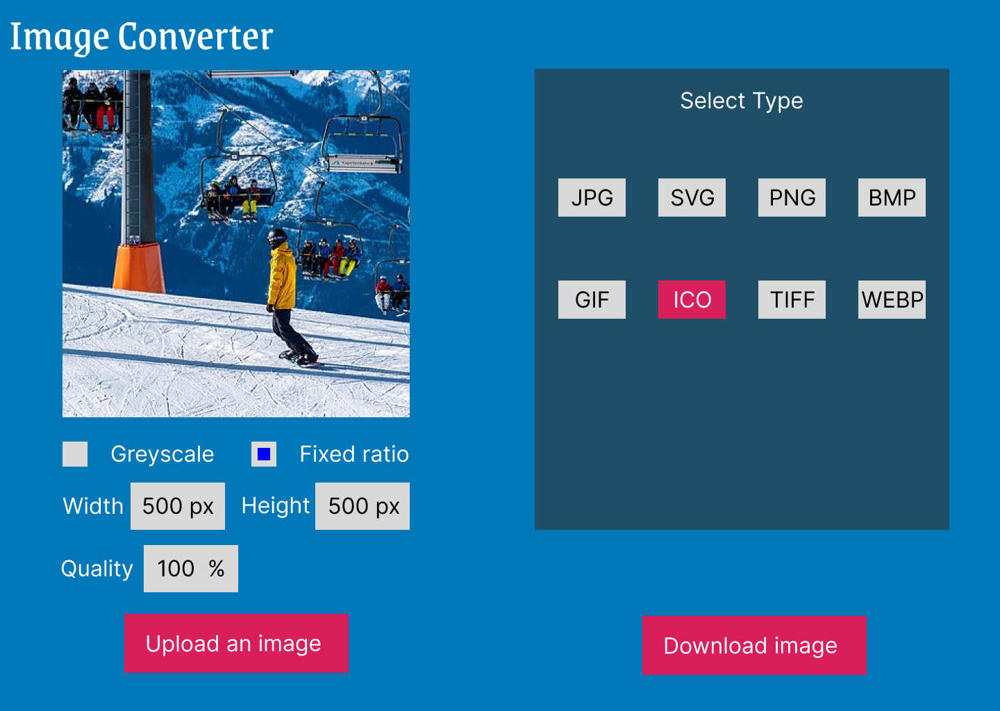

# Contents
- [Contents](#contents)
- [Badges](#badges)
- [Features](#features)
- [Commands](#commands)
  - [```Install```](#install)
  - [```Editing```](#editing)
  - [```Scripts```](#scripts)
    - [```npm start```](#npm-start)
    - [```npm run build```](#npm-run-build)
    - [```npm run test```](#npm-run-test)
    - [```npm run test:watch```](#npm-run-testwatch)
- [Technologies](#technologies)
  - [Frontend](#frontend)
- [Design](#design)
- [License](#license)

# Badges


# Features

This is a single page app that enables the following

- Compressing images
- Resize images
- Convert from one type to another


# Commands

## ```Install```

Clone the repo
```sh
git clone https://github.com/Diorla/image-converter
```

## ```Editing```
Use any text-editor to update the content

## ```Scripts```

### ```npm start```
To start both server and client.

Opens at localhost:1963


### ```npm run build```

build client side with production mode. `Service worker` is available in the production mode.

### ```npm run test```

npm run test

### ```npm run test:watch```

npm run test in watch mode


# Technologies
This is divided into frontend and backend

## Frontend
This web app was created using `create-react-app`. It uses `react` and `typescript`


# Design

- Rough mock-up made with adobe XD. The prototype could be found [here](https://xd.adobe.com/view/9ef40253-48c5-4bce-95ac-5e7ffd3e9396-cba7/screen/9d36ab1e-e03b-45c6-9cfc-bba0481d50e7).

# License
This is under [MIT](https://choosealicense.com/licenses/mit/) license, for more details, please check [License](https://github.com/Diorla/image-converter/blob/main/LICENCE)

[(Back to top)](#contents)